# 🤖 NexIoT AI物联网平台

## 🎯 创新的"真·零代码侵入"物联网平台

> **💡 突破传统物联网平台设计思路 · 设备驱动完全外置 · 一键导出即用 · 零代码侵入**

[📖 文档地址](https://nexiotplatform.github.io/universal-iot-docs/) | [🌐 在线演示](http://iot.192886.xyz:81/) | [🔧 AI调试IDE](http://iot.192886.xyz:81/magic/debug/index.html)

**中文 | [English](../README.md)**

## ✨ 平台简介

**NexIoT AI物联网平台** 是一款采用创新架构设计的**真·零代码侵入**企业级物联网平台。

### 🎯 核心亮点

> **🚀 这个项目能为你做什么？**

- 🏢 **适合中大型企业**：**IoT基础能力中心，统一的设备数据接入**，想做自己产品的，做B｜G项目
- 🔓 **不再被卡脖子**：不再被某一个设备供应商、软件提供商卡脖子，漫天要价
- 🎓 **上手简单**：不会Java也能完成设备接入，调试器大学生就能上手，节省大量研发、测试、运维
- 🤝 **生态共建**：产品、物模型、驱动内容，一键导出，生态共建共享
- ⚡ **实时热部署**：**实时热部署**生效，0款到100款设备对接，几年都不用重启服务
- 🚀 **高可用集群**：开源版支持集群，千万设备，不再话下

## 🌟 平台亮点

- ✅ **零代码侵入**：设备驱动外置、无需修改平台代码，无需重新编译部署，与平台核心代码零耦合，真正的零侵入
- ✅ **全协议支持**：TCP、Modbus RTU/TCP、MQTT、HTTP等工业协议和物联网协议
- ✅ **云平台对接**：天翼物联、移动OneNet、WVPGB28281国标视频等平台集成
- ✅ **多数据库支持**：支持 **MySQL 8.0+**、**IoTDB**、**ClickHouse**、**InfluxDB**、 等关系和时序数据库

## 🏗️ 技术架构

### 🛠️ 技术栈

#### 🚀 核心框架（极简轻量）

- **后端框架**：`Java 21` `SpringBoot 3.5` `Tk.Mybatis 5.0.1` 
- **前端技术**：基于`RuoYi-Antdv`构建，感谢开源社区！
- **日志存储**：**IoTDB** / **ClickHouse** / **InfluxDB** / MySQL / None（产品级无感动态切换）

## 🧭 部署与启动（一键启动）

### 镜像为2025年12月5日企业版镜像（预览），含闭源的接入协议！

- **一键启动**：`docker-compose up -d`
- **访问地址**：
  - 后台 `http://localhost:80`（默认 `nexiot/nexiot@123321`）
  - IDE调试器 `http://localhost:9092/magic/debug/index.html` (密码同后台）
  - EMQX 管理 `http://localhost:18083`（默认 `admin/public`）

> **🔧 真实设备演示请加微信，感谢！！**

## 📈 正在推进

###  近期规划（roadmap)

- **🚀 WVP视频平集成（计划26年1月）**：与WVP视频平台系列集成 `✅（202512月已完成）`
- **🚀 大华ICC系列产品**：与大华ICC产品系列集成`（无环境，延期中）`
- **🚀 海康综合安防管理平台**：使用海康平台产品系列集成`（无环境，延期中）`
- **📱 移动端应用（计划25年12月）**：付费图鸟定小程序，具备指令控制、属性、告警查看，轻量化、多管理员`✅（202512月beta已完成）`
- **📱 组态集成（计划26年3月）**：组态与nexiot集成

## 🚀 快速开始

### 🎯 演示地址（最新版本）

> **✨ 全部真实设备，驱动源码开放，全部透明可见！**

> **💎 由 [风铃云](https://www.aeoliancloud.com/cart/goodsList.htm) 独家赞助 NexIoT 在线演示服务器**

- **🌐 演示地址**：<http://demo.nexiot.cc/>
- **🔧 调试IDE**：<http://demo.nexiot.cc/magic/debug/index.html>
- **👤 演示账号**：`test`
- **🔑 演示密码**：`nexiot@123321`
- **📖 文档地址**：<https://docs.nexiot.cc/>

## 📊 功能详解
 
> **开源与企业版本区别，请点击 [版本区别](https://docs.nexiot.cc/versions/comparison.html/ "版本区别")** 查看

- [x] 基于 JDK21、虚拟线程，支持 RBAC，完成安全修复，通过三级等保；**开源支持集群**
- [x] 支持 WEB-IDE 产品驱动编写，真正“零”代码侵入面向协议
- [x] 热更新与零侵入：产品驱动/协议外置，一键导入导出即可使用，热部署
- [x] 多协议接入：**不改代码**支持任意 TCP 协议、任意 MQTT Topic主题和任意格式消息设备接入，支持粘包/分包、读写超时、解析器类型全部页面可配和扩展
- [x] 第三方 MQTT 兼容：支持绑定/解绑外部 MQTT Broker，自定义下行主题，扩展接入上限
- [x] 数据策略：自动注册、按属性/事件独立留存，16 进制/字符串收发可配，日志存储 None/MySQL/ClickHouse/IoTDB/**InfluxDB** 可无感切换
- [x] 产品管理
    - [x] 支持物模型定义（属性、事件、功能），导入、导出
    - [x] 支持设置不同产品的设备离线阈值
    - [x] 支持设置产品文档地址、产品图片上传
    - [x] **支持配置数据接收/发送类型（16 进制、字符串）**
- [x] **支持开启设备主动注册**
- [x] **支持设置TCP粘包、分包、读写超时、解析器类型等策略**
- [x] 支持数据留存策略（按属性或事件独立存储，用于BI数据分析）
- [x] **支持定义设备注册额外参数（如安全码，密钥）**
- [x] **支持第三方MQTT下行主题**、HTTP服务地址
- [x] **支持使用第三方MQTT服务组件、绑定/解绑**
- [x] **产品驱动支持IDE（Magic）、JAR（本地打包和远程URI）、JavaScript、SpringBean等方式的驱动编写**
- [x] **零代码侵入**设备接入
    - [x] 支持任意TCP协议的的接入（演示站有人塔石DTU网关、JT808、DLT645-2007电表等50余款）
    - [x] 支持设备任意MQTT协议和主题的接入（不管是否复杂的签名交互、简单数据上报）
    - [x] 支持设备的完整生命周期管理
    - [x] 支持一个网关接入**各种不同子设备**
    - [x] 支持同时两种以上的北向应用数据推送（HTTP、MQTT）
    - [x] 支持独立的数据订阅、规则转发
    - [x] 支持网关、网关子设备的拓扑关系
    - [x] 网关子设备支持**直接发起功能指令调用**，统一标准
    - [x] 支持设备实时状态查看、历史数据、可视化图表、位置地图轨迹和完整的日志记录
    - [x] 支持设备影子，支持属性的期望值写入（任意的标签和数据暂存）
    - [x] **支持指令调用（含API）和设备回复的消息匹配**，执行成功而不是调用平台成功
- [x] 应用管理（类似多租户）
    - [x] 支持创建多个应用
    - [x] 支持应用生成独立的AK/SK，独立的数据北向地址
    - [x] 支持OAuth2标准授权，支持（Maven）Java标准SDK
    - [x] **任意普通用户，支持无限制数量租户小程序**；小程序支持多管理、增、删、改查、功能调用、各种权限控制
    - [x] 小程序`支持主题色`、`名字`、`LOGO`等远程配置
    - [x] 支持`H5`、`Android`、`IOS`
- [x] 通知管理
    - [x] 支持通知渠道管理（含钉钉、短信、语音、飞书、邮件等）
    - [x] 支持设备数据模版的填充
    - [x] 支持任意通知模版的格式定义，不管是WEBHOOK还是邮件，高自由度，模版替换渲染
- [x] 支持**天翼物联（CTAIOT）** 完美对接；产品、设备全部在`nexiot`统一管理
- [x] 支持无感动态切换日志存储方式，支持None(不存) / Mysql / ClickHouse / IoTDB / InfluxDB，**全网最多**
- [x] 支持产品导出、一键导入（含物模型、设备驱动等）真正实现驱动生态共享，**你导出驱动，我导入使用**
- [x] 视频能力
    - [x] 支持国标GB2828-2016/2022视频接入，支持**NVR**
    - [x] 支持乐橙云视频视频接入
    - [x] **视频API与普通设备的统一物模型调用**

### 📢 高级特性

#### 202512
- 无应答设备适配：时间窗口设计，支持API指定消息序号,回调告诉你执行状态，让你不再大海捞针
- 复杂交互 ACK：IDE协议编写的一行代码，快速实现指令应答闭环
- 小程序多用户管理的控制权限

## 📸 实战案例与视频教程

### 📊 已对接设备案例（仅展示部分）

|                                                |                                                |                                        |
|------------------------------------------------|------------------------------------------------|----------------------------------------|
|       |          |    |
|           |      |     |
|          |  |  |

#### ⚡ 接入成果展示

---

## 📸 平台界面展示

|          🏗️ 驱动的系统架构                            |           🚀 云原生部署架构                              |
|---------------------------------------|-----------------------------------------|
|  |  |

### 🖥️ 智能化功能展示

#### 📺 产品管理

|                                                         |                                                             |
|---------------------------------------------------------|-------------------------------------------------------------|
|          |            |
|  |      |
|      |       |
|           |      |
|  |  |

#### 📺 设备管理

|                                                     |                                                    |
|-----------------------------------------------------|----------------------------------------------------|
|       |    |
|     |         |
|     |      |
|  |     |
|     |  |

#### 🚀所有协议可视化管理和在线调试

| 调试断点                                         | 运行结果                                         |
|----------------------------------------------|----------------------------------------------|
|  |  |

#### 🔄 规则编排和引擎

|                                                     |                                                          |
|-----------------------------------------------------|----------------------------------------------------------|
|     |       |
|  |             |
|   |  |
|          |             |

### 🛠️ 网络组件

|                                  |                                              |                                           |
|-----------------------------------------------|----------------------------------------------------------|-------------------------------------------------|
|  |  |  |

### 🛠️ 北向应用多租户应用

|                                            |                                             |                                            |
|--------------------------------------------|---------------------------------------------|--------------------------------------------|
|  |  |  |

### 🎯 数据分析和趋势

|                                                      |                                                  |                                                    |
|------------------------------------------------------|--------------------------------------------------|----------------------------------------------------|
|  |  |  |
|  |                        |  |

### 🎯 wvp-GB28281-wvp+海康ISC+大华ICC

|                                                 |                                         ||
|-------------------------------------------------|-----------------------------------------|---|
|  |    |    
|              |      | |
|        |

#### 🌐 天翼产品接入

### 🚀 组态大屏一体化集成（内测中）

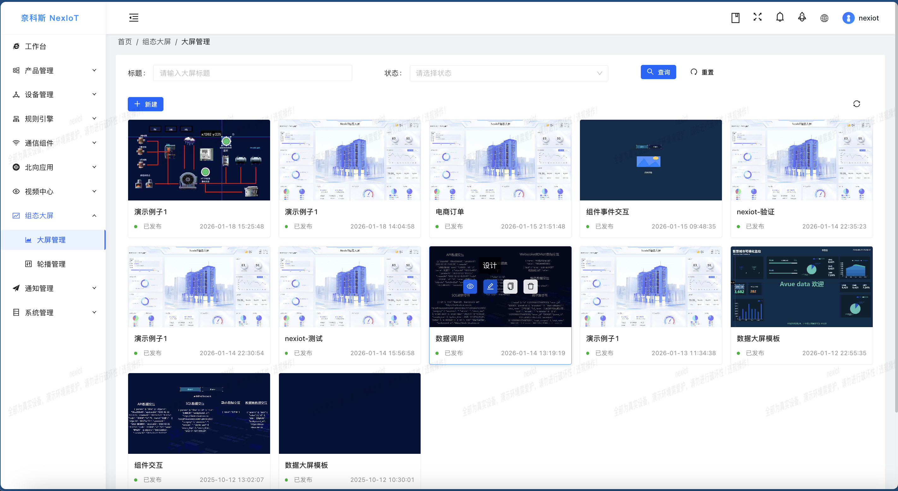

| 大屏                                          | 组态                                        | 
|---------------------------------------------|-------------------------------------------|
| 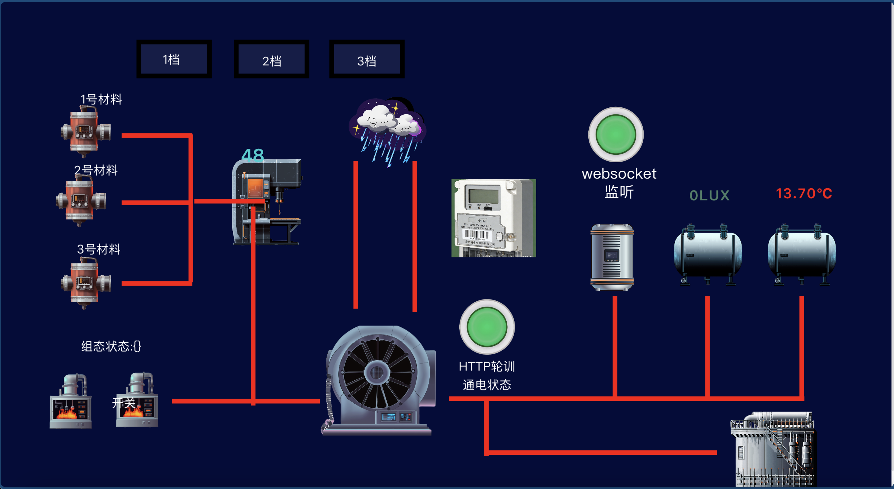   | 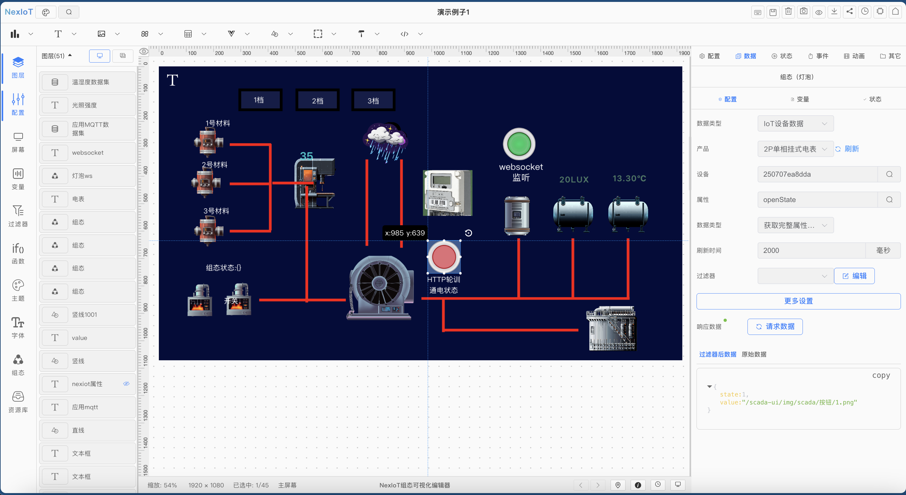 |
| 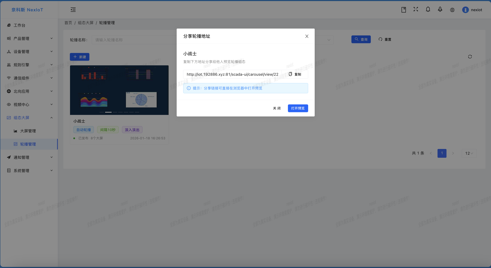 | 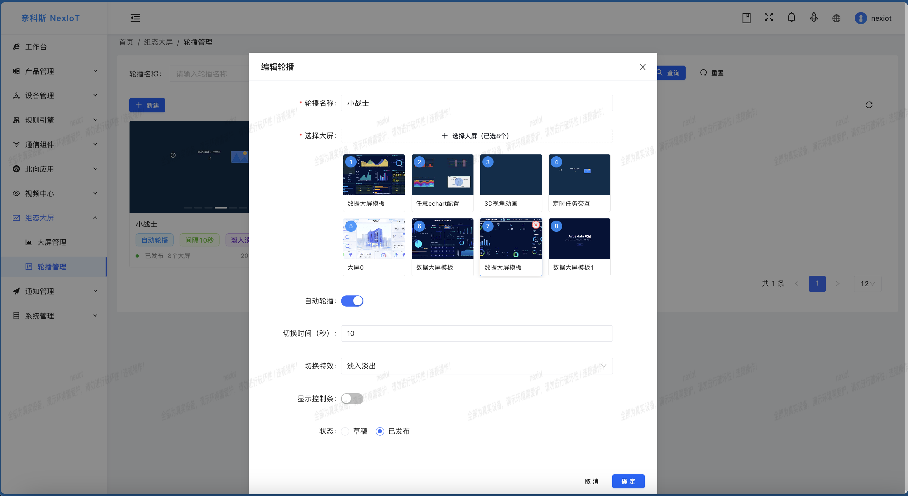 |
| 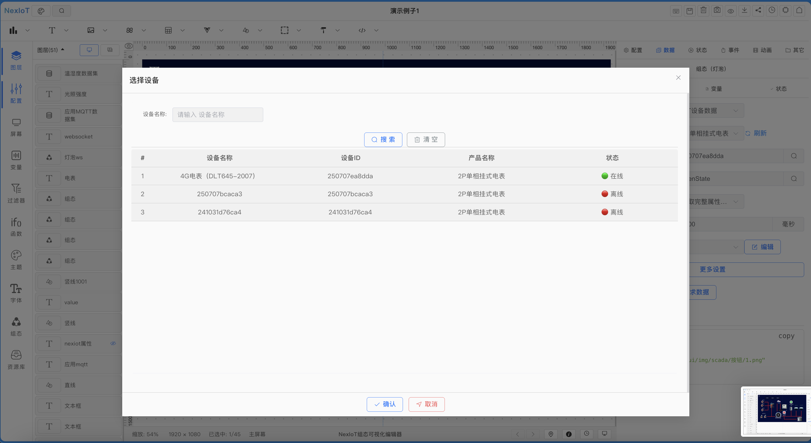 | 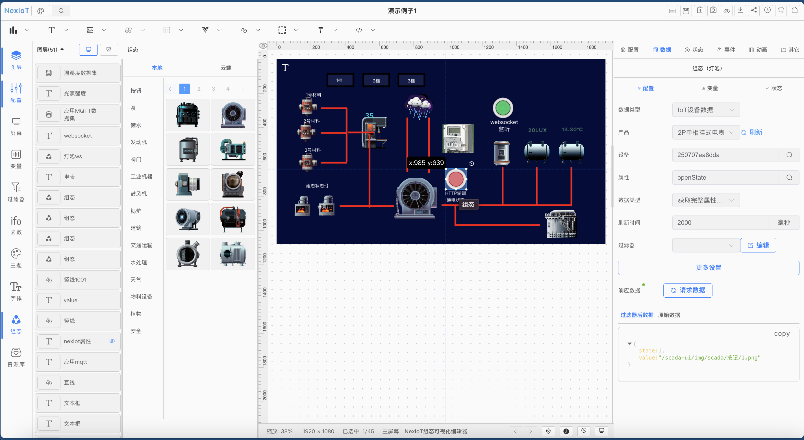 |
|  | 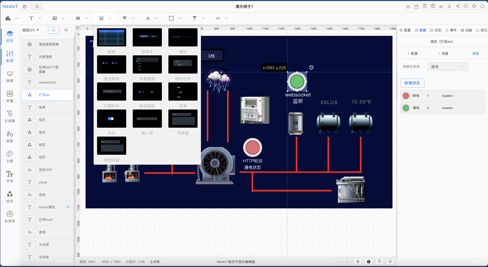 |

### 🎯 移动端/小程序

|                                               |                                              |                                              |
|-----------------------------------------------|----------------------------------------------|----------------------------------------------|
|  | 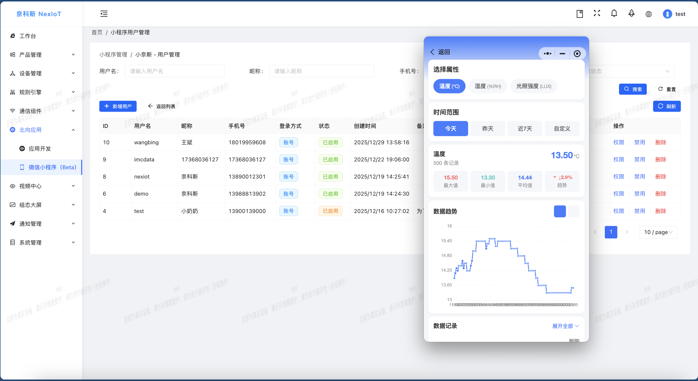 | 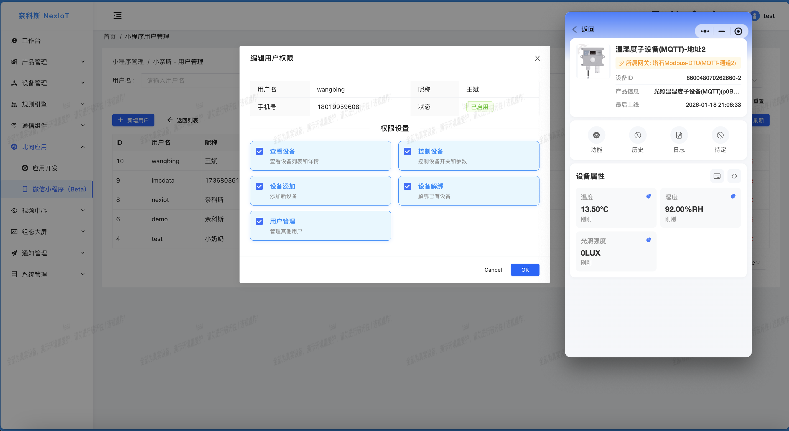 |

|                                    |                                   |                                   | 
|------------------------------------|-----------------------------------|-----------------------------------|
|  | 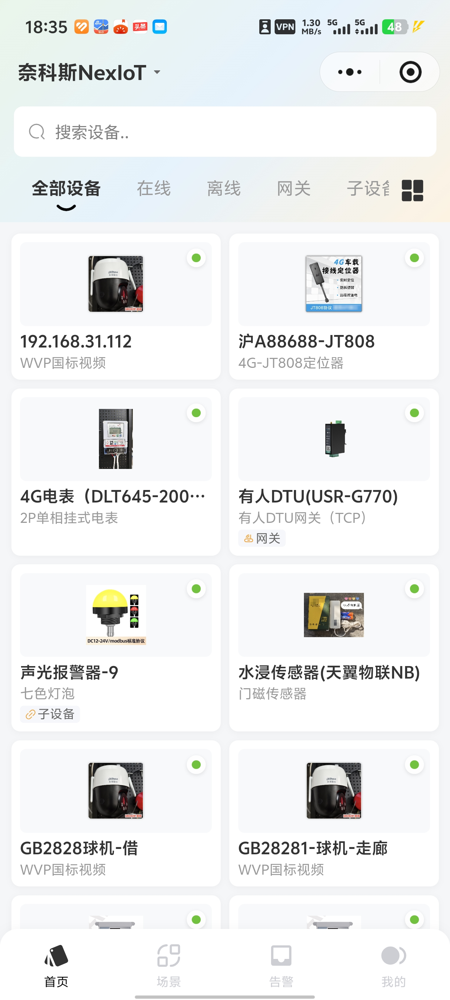 | 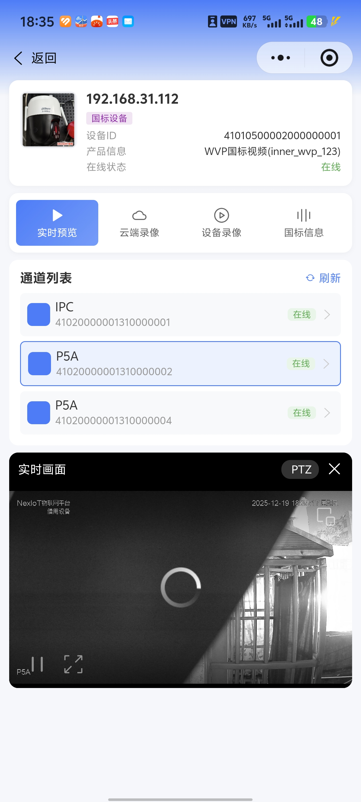 |
|  | 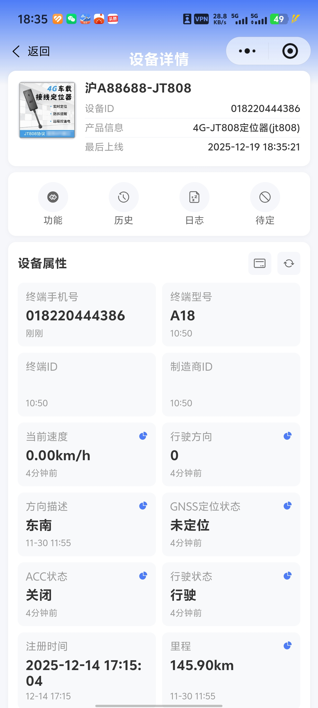 | 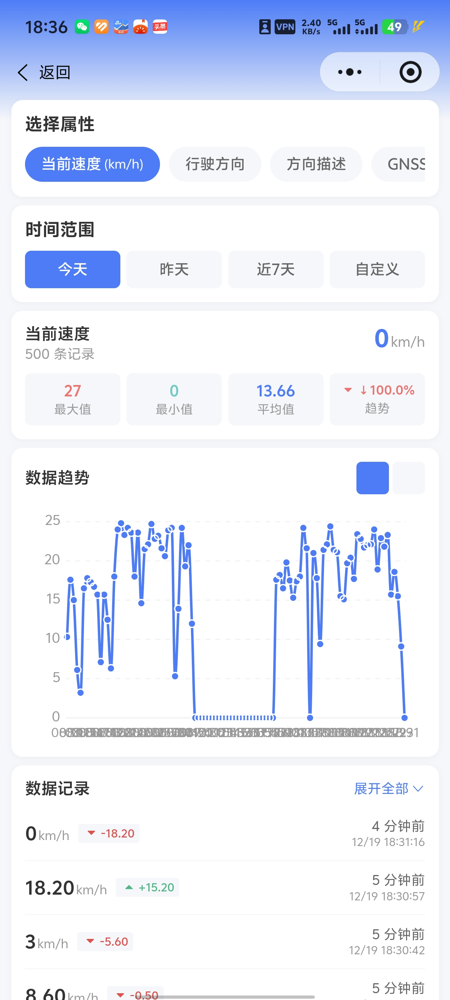 |

> 视频【NexIoT小程序，这次很强！】 https://www.bilibili.com/video/BV1WMqDB6EAc/?share_source=copy_web&vd_source=c9e1500efcc8aa0763f711fadaa68dff

## 📺 视频教程

更多视频请关注B站和抖音

### 📚 基础入门教程

| 序号 | 教程名称 | 视频链接 |
|:---:|:---|:---|
| 1 | 【NexIoT课程】（一）IDEA与Docker一键启动 | [📺 B站观看](https://www.bilibili.com/video/BV1WNUnBnEx5/?share_source=copy_web&vd_source=c9e1500efcc8aa0763f711fadaa68dff) |
| 2 | 【NexIoT课程】（二）EMQX配置 | [📺 B站观看](https://www.bilibili.com/video/BV1MdUJB4E7k/?share_source=copy_web&vd_source=c9e1500efcc8aa0763f711fadaa68dff) |

### 📨 MQTT接入教程

| 序号 | 教程名称 | 视频链接 |
|:---:|:---|:---|
| 1 | 任意主题Topic与全流程对接教程 | [📺 B站观看](https://www.bilibili.com/video/BV1q1UZBmEHS/?share_source=copy_web&vd_source=c9e1500efcc8aa0763f711fadaa68dff) |

### 📢 重要声明

- **自媒体转发**：欢迎转发项目信息，请遵循AGPL3.0开源协议
- **企业授权**：商业使用需获得授权，保留企业授权信息
- **法律追责**：如单位误用引起法律后果，保留追责责任

### 🌐 社区联系方式

|微信                            | B站                              | 抖音                               | 小程序                           |
|-------------------------------|---------------------------------|----------------------------------|-------------------------------|
|   |  |  |  |

## 🛠️ 技术支持与服务

我们提供全方位的技术支持服务，从基础答疑到企业级解决方案，满足不同层次的需求。收费是为了提供更好的服务，也是对作者更大的激励!

### 📋 服务类型对比

| 服务类型          | 服务内容                                 | 价格           | 适用场景      | 联系方式                                                         |
|---------------|--------------------------------------|--------------|-----------|--------------------------------------------------------------|
| **🆓 社区技术答疑** | • 基础问题答疑 • 使用指导 • 社区交流         | **免费**       | 学习、使用     | QQ群、微信群                                                      |
| **📚 技术文档**   | • 技术文档 • 实践指南 • 视频教程           | **免费**       | 自学、参考     | [文档地址](https://docs.nexiot.cc/) |
| **☁️ 线上部署服务** | • 客户提供硬件 • 完成系统部署 • 云服务部署      | **¥199**     | 快速上线、云部署  | 联系技术                                                         |
| **🔧 专属技术支持** | • 各类对接支持 • 使用指导 • 部署方案 • 解决方案 | **¥600/4小时** | 远程支持      | 联系技术                                                         |
| **⚡ 设备接入服务**  | • IDE解析源码 • 产品配置导出 • 定制化接入     | **¥1000/日**  | 复杂设备接入、定制开发 | 联系客服                                                         |
| **🏢 企业省心服务** | • 商业版本地部署 • 代运维服务 • 5×8技术支持    | **¥9,999/年** | -         | 联系客服                                                         |

---

## 📄 开源协议与授权

请遵循AGPL3.0开源协议，商业使用须获得授权

### 📜 详细授权条款

#### ✅ 授权用户权益

1. **内部使用**：授权用户可无限期在其内部使用
    - 企业授权：不含分公司、子公司及第三方公司
    - 个人授权：仅限个人使用，不可用于在职公司或第三方

2. **开发权限**：授权用户可通过项目形式进行源码二次开发
    - 定制化软件必须加密打包后交付客户
    - 如需交付源码，必须为客户购买对应商业授权

#### ❌ 授权限制

1. **禁止转让**：不可向第三方发行或转让授权源码
    - 无论有偿或无偿转让
    - 不可申请包含本项目的软件著作权

### 🔒 闭源内容

 **TCP**、**UDP**、**天翼物联ctaiot** 模块。可自行二次开发扩展，商业用途需赞助项目，获得授权。

### 🙏 致谢

感谢以下开源项目和技术平台：

- **开源框架**：若依、Antdv、jetlink、ssssssss-team
- **云平台**：阿里云、华为云、腾讯云、AEP、OneNet 等物联网平台
- **社区支持**：所有贡献者和用户的支持与反馈

### 客户情况

- **市/区级智慧城市物联网平台**
- **某港地铁**
- **上市企业**
- **企业园区**
- **智慧化项目**
- **其他行业客户**
