# 🤖 NexIoT AI物联网平台

## 🎯 创新的"真·零代码侵入"物联网平台

> **💡 突破传统物联网平台设计思路 · 设备驱动完全外置 · 一键导出即用 · 零代码侵入**

[📖 文档地址](https://nexiotplatform.github.io/universal-iot-docs/) | [🌐 在线演示](http://iot.192886.xyz:81/) | [🔧 AI调试IDE](http://iot.192886.xyz:81/magic/debug/index.html)

**中文 | [English](README_EN.md)**

## ✨ 平台简介

**NexIoT AI物联网平台** 是一款采用创新架构设计的**真·零代码侵入**企业级物联网平台。

### 🎯 核心亮点

> **🚀 这个项目能为你做什么？**

- 🏢 **适合中大型企业**：**IoT基础能力中心，统一的设备数据接入**，想做自己产品的，做B｜G项目
- 🔓 **不再被卡脖子**：不再被某一个设备供应商、软件提供商卡脖子，漫天要价
- 🎓 **上手简单**：不会Java也能完成设备接入，调试器大学生就能上手，节省大量研发、测试、运维
- 🤝 **生态共建**：产品、物模型、驱动内容，一键导出，生态共建共享
- ⚡ **实时热部署**：**实时热部署**生效，0款到100款设备对接，几年都不用重启服务
- 🚀 **高可用集群**：开源版支持集群，千万设备，不再话下

## 🌟 平台亮点

- ✅ **零代码侵入**：设备驱动外置、无需修改平台代码，无需重新编译部署，与平台核心代码零耦合，真正的零侵入
- ✅ **全协议支持**：TCP、Modbus RTU/TCP、MQTT、HTTP等工业协议和物联网协议
- ✅ **云平台对接**：天翼物联、移动OneNet、WVPGB28281国标视频等平台集成
- ✅ **多数据库支持**：支持 **MySQL 8.0+**、**IoTDB**、**ClickHouse**、**InfluxDB**、 **TDengine** 等关系和时序数据库

## 🏗️ 技术架构

### 🛠️ 技术栈

#### 🚀 核心框架（极简轻量）

- **后端框架**：`Java 21` `SpringBoot 3.5` `Tk.Mybatis 5.0.1` 
- **前端技术**：基于`RuoYi-Antdv`构建，感谢开源社区！
- **日志存储**：**IoTDB** / **TDengine** / **ClickHouse** / **InfluxDB** / MySQL / None（产品级无感动态切换）

## 🧭 部署与启动（一键启动）

[//]: # (### 镜像为2025年12月5日企业版镜像（预览），含闭源的接入协议！)

- **一键启动**：`docker-compose up -d`
- **访问地址**：
  - 后台 `http://localhost:80`（默认 `nexiot/nexiot@123321`）
  - IDE调试器 `http://localhost:9092/magic/debug/index.html` (密码同后台）
  - EMQX 管理 `http://localhost:18083`（默认 `admin/public`）

> **🔧 真实设备演示请加微信，感谢！！**

## 📈 正在推进

###  近期规划（roadmap)

- **🚀 WVP视频平集成（计划26年1月）**：与WVP视频平台系列集成 `✅（202512月已完成）`
- **🚀 大华ICC系列产品**：与大华ICC产品系列集成`✅（202601月已完成beta）`
- **🚀 海康综合安防管理平台**：使用海康平台产品系列集成`✅（202604月视频已完成,感谢耿老板的环境）`
- **📱 移动端应用（计划25年12月）**：付费图鸟定小程序，具备指令控制、属性、告警查看，轻量化、多管理员`✅（202512月beta已完成）`
- **📱 组态大屏集成（计划26年3月）**：组态与nexiot集成`✅（202601月已完成）`
- **📱 奈科斯应用工坊（计划26年5月）**：SAAS应用+移动端+多租户+DIY装修 ✅（202603月已完成）`
- **📱 通通锁平台**：支持云账号和通通锁账号 ✅（202603月已完成）`
- **📱 可视化驱动**：支持可视化驱动，不是技术人员就完成设备接入 ✅（202603月已完成）`
- **📱 多租户**：支持多租户 🔧（202605月公测）`
- **📱 图表可视化**：支持不同产品设备的数据图表、饼图、折线图历史和实时数据显示 ✅（202604月已完成）
- **📱 免费正式环境**：3年免费使用！备案中

## 🚀 快速开始

### 🎯 演示地址（最新版本）

> **✨ 全部真实设备，驱动源码开放，全部透明可见！**

> **💎 由 [风铃云](https://www.aeoliancloud.com/cart/goodsList.htm) 独家赞助 NexIoT 在线演示服务器**

- **🌐 演示地址**：<http://demo.nexiot.cc/>
- **🔧 调试IDE**：<http://demo.nexiot.cc/magic/debug/index.html>
- **👤 演示账号**：`test`
- **🔑 演示密码**：关注【开源啦】公众号即可获取。获取如果打不开请加微信：outlookFil
- **📖 文档地址**：<https://docs.nexiot.cc/>

## 支持的协议

| 大类           | 小类 / 协议                    | 场景和设备描述                                             | 支持状态    | 备注                   |
|--------------|----------------------------|-----------------------------------------------------|---------|----------------------|
| MQTT 接入      | 系统内置MQTT /                 | 自研传感器、边缘网关、低功耗设备、网关子设备；设备通过 MQTT 上报属性、事件和状态，平台下发指令。 | ✅ 开源已支持 | -                    |
| MQTT 接入      | 第三方 MQTT Broker            | 客户已有 EMQX、HiveMQ、VerneMQ 或其他 MQTT Broker，希望复用现有消息通道。 | ✅ 开源已支持 | -                    |
| Modbus DTU   | 有人/塔石等DTU                  | modbus透传解析网关与子设备                                    | ✅ 开源已支持 | -                    |
| HTTP 接入      | HTTP / HTTPS API           | 第三方业务系统、软件平台、Web 服务主动推送设备数据，或平台间云云对接。               | ✅ 开源已支持 |                      |
| TCP 直连       | TCP 私有协议设备                 | DTU、网关、JT/T 808 车载定位、DL/T 645 电表、适配二进制、16 进制、JSON、自定义 。            | ⭐ 商业已支持 | |
| UDP 直连       | UDP 短报文设备                  | 定位设备、低功耗设备、简单传感器、短报文上报设备。                           | ⭐ 商业已支持 |                      |
| 工业协议         | Siemens S7                 | 西门子 S7 PLC，产线设备、设备控制柜、工业控制系统。                       | ⭐ 商业已支持 |                      |
| 工业协议         | OPC UA                     | OPC UA Server、工业网关、PLC、SCADA/DCS 数据服务。              | ⭐ 商业已支持 |                      |
| 工业协议         | 新 Modbus 工业采集              | 工业现场 Modbus TCP/RTU 设备，需按端点、点位、采集组统一管理。             | ⭐ 商业已支持 |                      |
| 工业协议         | EtherNet/IP                | Rockwell / Logix PLC 及 EtherNet/IP 现场设备。            | 🔧 内测中  |                      |
| 工业协议         | BACnet/IP                  | 楼宇自控、空调、照明、BA 设备、园区机电设备。                            | 🔧 内测中 |                      |
| 工业协议         | Beckhoff ADS               | 倍福 PLC、TwinCAT 控制系统。                                | 🔧 内测中 |                      |
| 工业协议         | Mitsubishi MC              | 三菱 PLC。                                             | 🔧 内测中 |                      |
| 工业协议         | Omron FINS                 | 欧姆龙 PLC。                                            | 🔧 内测中 |                      |
| 运营商云平台       | CTWing / 天翼物联 CT-AIoT      | 电信 NB-IoT 设备。支持 **2913 款公共产品**              | ⭐ 商业已支持 | -                    |
| 运营商云平台       | OneNET / 移动物联网平台           | 已接入中国移动 OneNET 的设备和项目。                              | ⭐ 商业已支持 | -                    |
| 视频安防         |  GB28181                   | 国标摄像机、NVR、视频平台、园区/工地/安防视频项目。                        | ⭐ 商业已支持 | -                    |
| 视频安防         | 海康 ISC                     | 海康 iSecure Center 综合安防平台。                           | ⭐ 商业已支持 | -                    |
| 视频安防         | 大华 ICC                     | 大华智能物联综合管理平台。                                       | ⭐ 商业已支持 | -                    |
| 视频安防         | ONVIF / RTSP               | 局域网摄像机、RTSP 视频流、本地网络摄像头。                            | ⭐ 商业已支持 | -                    |
| 视频安防         | 海康 / 大华 Direct SDK Gateway | 无上级平台、需要直连摄像机或 NVR 的海康/大华项目。                        | ⭐ 商业已支持 |                      |
| 视频安防         |  乐橙云                  | 云摄像机、门店/连锁/轻量安防项目。                                  | ⭐ 商业已支持 |                      |
| 第三方平台        | TTLock / 通通锁               | 智能门锁、公寓门锁、酒店门锁、门禁锁。                                 | ⭐ 商业已支持 | -                    |
| 自定义扩展        | 协议脚本 / WebIDE 调试           | 协议不标准、需要现场联调、客户只有报文样例或协议文档的设备。                      | ✅ 开源已支持 | -                    |

## 📊 功能详解
 

[//]: # (> **如需了解开源版与企业版完整差异，可查看 [版ƒ本区别]&#40;https://docs.nexiot.cc/versions/comparison.html/ "版本区别"&#41;** 查看)

- [x] 基于 JDK21、虚拟线程，支持 RBAC，完成安全修复，通过三级等保；**开源支持集群**
- [x] 支持 WEB-IDE 产品驱动编写，真正“零”代码侵入面向协议
- [x] 热更新与零侵入：产品驱动/协议外置，一键导入导出即可使用，热部署
- [x] 多协议接入：**不改代码**支持任意 TCP 协议、任意 MQTT Topic主题和任意格式消息设备接入，支持粘包/分包、读写超时、解析器类型全部页面可配和扩展
- [x] 第三方 MQTT 兼容：支持绑定/解绑外部 MQTT Broker，自定义下行主题，扩展接入上限
- [x] 数据策略：自动注册、按属性/事件独立留存，16 进制/字符串收发可配，日志存储 None/MySQL/ClickHouse/IoTDB/InfluxDB/TDengine 可无感切换
- [x] 产品管理
    - [x] 支持物模型定义（属性、事件、功能），导入、导出
    - [x] 支持设置不同产品的设备离线阈值
    - [x] 支持设置产品文档地址、产品图片上传
    - [x] **支持配置数据接收/发送类型（16 进制、字符串）**
    - [x] **支持OTA全量/灰度功能**
- [x] **支持开启设备主动注册**
- [x] **支持设置TCP粘包、分包、读写超时、解析器类型等策略**
- [x] 支持数据留存策略（按属性或事件独立存储，用于BI数据分析）
- [x] **支持定义设备注册额外参数（如安全码，密钥）**
- [x] **支持第三方MQTT下行主题**、HTTP服务地址
- [x] **支持使用第三方MQTT服务组件、绑定/解绑**
- [x] **产品驱动支持IDE（Magic）、JAR（本地打包和远程URI）、JavaScript、SpringBean等方式的驱动编写**
- [x] **零代码侵入**设备接入
    - [x] 支持任意TCP协议的的接入（演示站有人塔石DTU网关、JT808、DLT645-2007电表等50余款）
    - [x] 支持设备任意MQTT协议和主题的接入（不管是否复杂的签名交互、简单数据上报）
    - [x] 支持设备的完整生命周期管理
    - [x] 支持一个网关接入**各种不同子设备**
    - [x] 支持同时两种以上的北向应用数据推送（HTTP、MQTT）
    - [x] 支持独立的数据订阅、规则转发
    - [x] 支持网关、网关子设备的拓扑关系
    - [x] 网关子设备支持**直接发起功能指令调用**，统一标准
    - [x] 支持设备实时状态查看、历史数据、可视化图表、位置地图轨迹和完整的日志记录
    - [x] 支持设备影子，支持属性的期望值写入（任意的标签和数据暂存）
    - [x] **支持指令调用（含API）和设备回复的消息匹配**，执行成功而不是调用平台成功
    - [x] **支持可视化驱动，轻轻动动🤌手指，完成设备接入**
- [x] 应用管理（类似多租户）
    - [x] 支持创建多个应用
    - [x] 支持应用生成独立的AK/SK，独立的数据北向地址
    - [x] 支持OAuth2标准授权，支持（Maven）Java标准SDK
    - [x] **任意普通用户，支持无限制数量租户小程序**；小程序支持多管理、增、删、改查、功能调用、各种权限控制
    - [x] 小程序`支持`、`名字`、`LOGO`等远程配置
    - [x] 支持`H5`、`Android`、`IOS`
- [x] 通知管理
    - [x] 支持通知渠道管理（含钉钉、短信、语音、飞书、邮件等）
    - [x] 支持设备数据模版的填充
    - [x] 支持任意通知模版的格式定义，不管是WEBHOOK还是邮件，高自由度，模版替换渲染
- [x] 支持**天翼物联（CTAIOT）** 完美对接；产品、设备全部在`nexiot`统一管理
- [x] 支持无感动态切换日志存储方式，支持None(不存) / Mysql / ClickHouse / IoTDB / InfluxDB，TDengine **全网最多**
- [x] 支持产品导出、一键导入（含物模型、设备驱动等）真正实现驱动生态共享，**你导出驱动，我导入使用**
- [x] 视频能力
    - [x] 支持国标GB2828-2016/2022视频接入，支持**NVR**
    - [x] 支持乐橙云视频视频接入
    - [x] **视频API与普通设备的统一物模型调用**

|  NexIoT小程序                                                | 奈科斯应用工坊                                    |          奈科斯应用工坊安卓                       |
|------------------------------------------------------|--------------------------------------------|----------------------------------------------|
|   |  | |

### 🔥🔥🔥新产品预告！！新产品预告！

基于nexiot北向应用，构建奈科斯应用工坊

- **📖 访问入口**：<http://forge.192886.xyz:81//>
- **👤 演示账号**：`nexiot`
- **🔑 演示密码**：`nexiot@123321`
- **📖 项目地址**：<https://gitee.com/NexIoT/nexiot-app-workshop>

### 🎯 应用工坊-SAAS应用

|                                             |                                                   |                                               |
|---------------------------------------------|---------------------------------------------------|-----------------------------------------------|
|  |            |     |
|      |  |  |

### 🎯 应用工坊-SAAS应用-移动端DIY
|                                    |                                    |                                   |
|------------------------------------|------------------------------------|-----------------------------------|
|  |  |  |
|  |  |  |

### 📊 已对接设备案例

[//]: # ()
[//]: # (（仅展示部分）)

[//]: # ()
[//]: # (|                                                |                                                |                                        |)

[//]: # (|------------------------------------------------|------------------------------------------------|----------------------------------------|)

[//]: # (| ![电表设备]&#40;/__MACOSX/shot/1018/dianbiap.png&#41;      | ![摄像头]&#40;/__MACOSX/shot/1018/tongtongsuo.png&#41;    | ![水浸设备]&#40;/__MACOSX/shot/1018/111.jpg&#41;   |)

[//]: # (| ![网关DTU]&#40;/__MACOSX/shot/1018/dtu.jpg&#41;          | ![水浸设备]&#40;/__MACOSX/shot/1026/device-sj.jpg&#41;     | ![SOS]&#40;/__MACOSX/shot/1109/sos.jpg&#41;    |)

[//]: # (| ![4G定位器]&#40;/__MACOSX/shot/1018/4gcz.png&#41;         | ![声光报警器]&#40;/__MACOSX/shot/1026/device-sgbjq.png&#41; | ![水浸设备]&#40;/__MACOSX/shot/1018/4gcz2.png&#41; |)

#### ⚡ 接入成果展示

---

## 📸 平台界面展示

[//]: # (> 以下截图是【企业版】功能界面，会有UI调整，开源版请自行部署)

| 🏗️ 驱动的系统架构                          |           🚀 云原生部署架构                              |
|--------------------------------------|-----------------------------------------|
|  |  |

### 🖥️ 智能化功能展示(含商业版)

#### 📺 产品管理

|                                                         |                                                             |
|---------------------------------------------------------|-------------------------------------------------------------|
|          |            |
|  |      |
|      |       |
|           |      |
|  |  |

#### 📺 设备管理

|                                                     |                                                     |
|-----------------------------------------------------|-----------------------------------------------------|
|       |     |
|     |  |
|     |          |
|     |       |
|  |      |
|     |   |

#### 🚀驱动在线调试和可视化拖拽

| 调试断点                                               | 运行结果                                              |
|----------------------------------------------------|---------------------------------------------------|
|        |       |

#### 🔄 边云协同，隧道直连内容

| 云端管理                                               | 边云协作                                                |
|----------------------------------------------------|-----------------------------------------------------|
|  |  |

#### 🔄 规则编排和引擎

|                                                     |                                                          |
|-----------------------------------------------------|----------------------------------------------------------|
|   |  |
|          |             |

### 🛠️ 网络组件

|                                  |                                              |                                           |
|-----------------------------------------------|----------------------------------------------------------|-------------------------------------------------|
|  |  |  |

### 🛠️ 北向应用多租户应用

|                                            |                                             |                                            |
|--------------------------------------------|---------------------------------------------|--------------------------------------------|
|  |  |  |

### 🎯 数据分析和趋势

|                                                      |                                                  |                                                    |
|------------------------------------------------------|--------------------------------------------------|----------------------------------------------------|
|  |  |  |
|  |                        |  |

### 🎯 视频AIoT

|                                        |                                         |                                       | 
|----------------------------------------|-----------------------------------------|---------------------------------------|
|  |  |  |
|   |  |  |
### 🎯 wvp-GB28281-wvp+海康ISC+大华ICC

|                                                 |                                         ||
|-------------------------------------------------|-----------------------------------------|---|
|  |    |    
|              |      | |
|        |

#### 🌐 天翼产品接入

### 🚀 组态大屏一体化集成

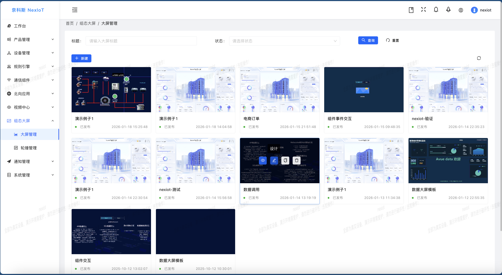

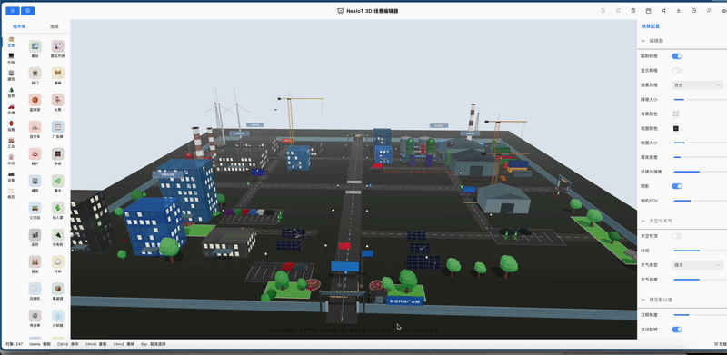

| 大屏                                          | 组态                                        | 
|---------------------------------------------|-------------------------------------------|
| 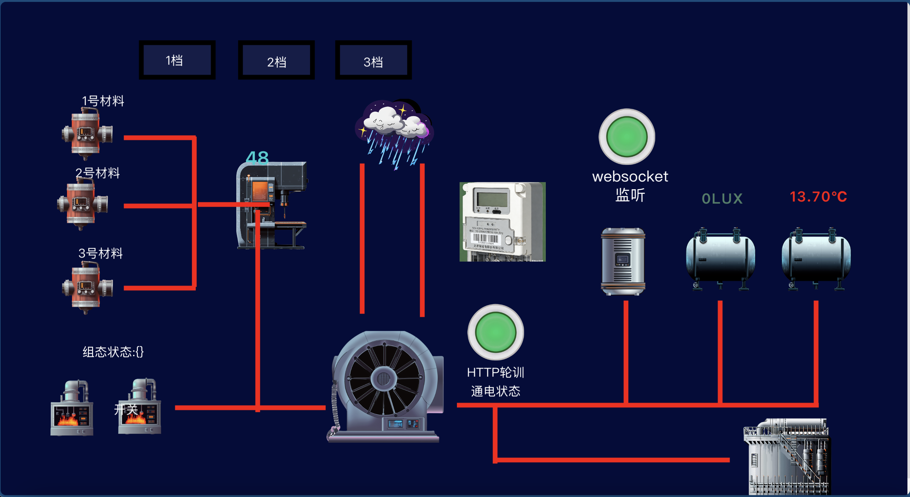   | 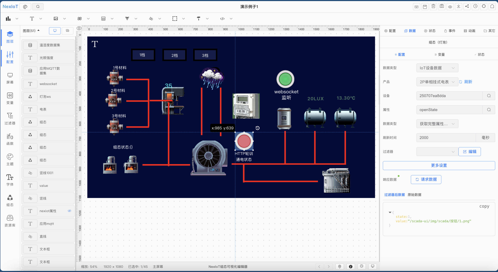 |
| 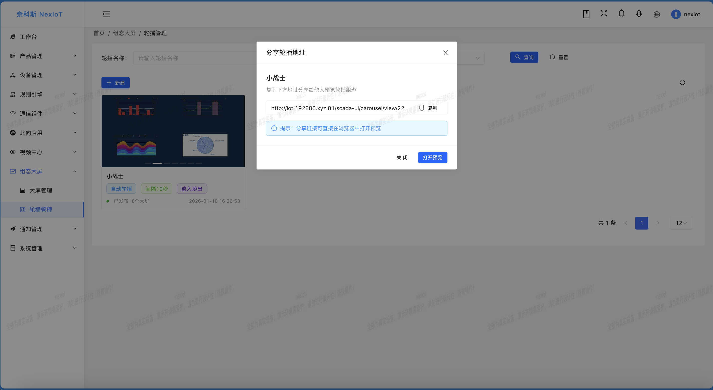 | 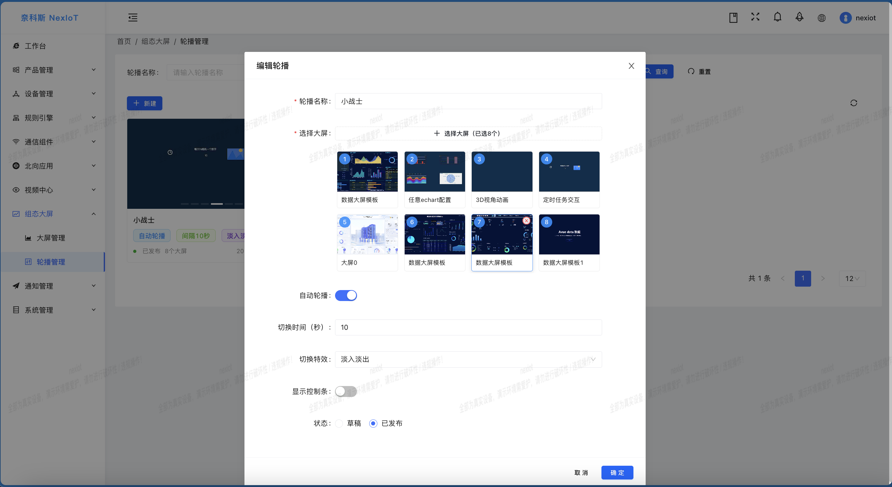 |
| 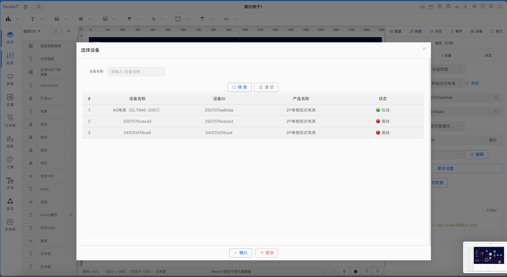 | 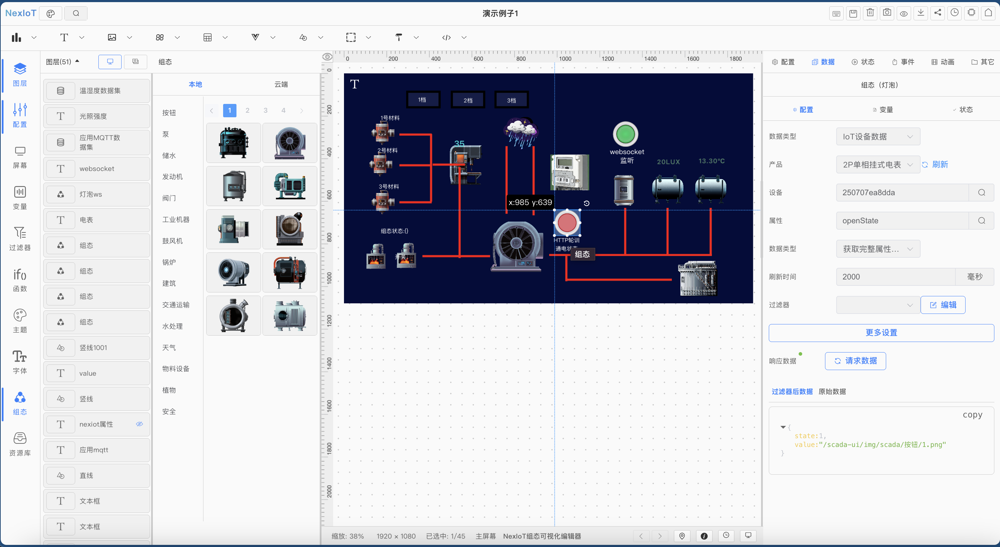 |
| 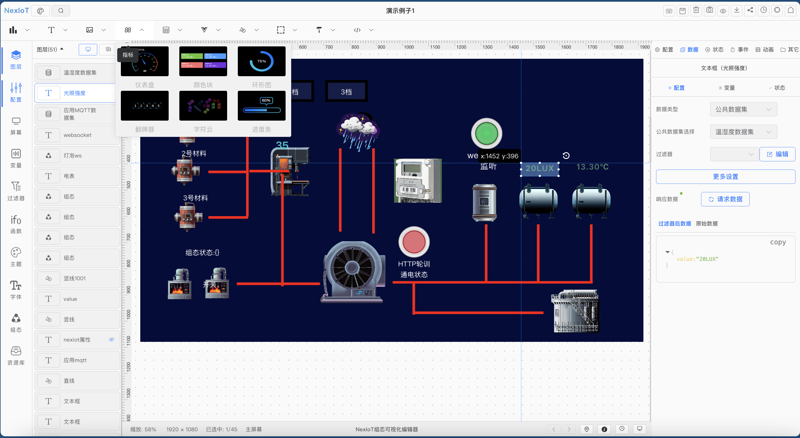 | 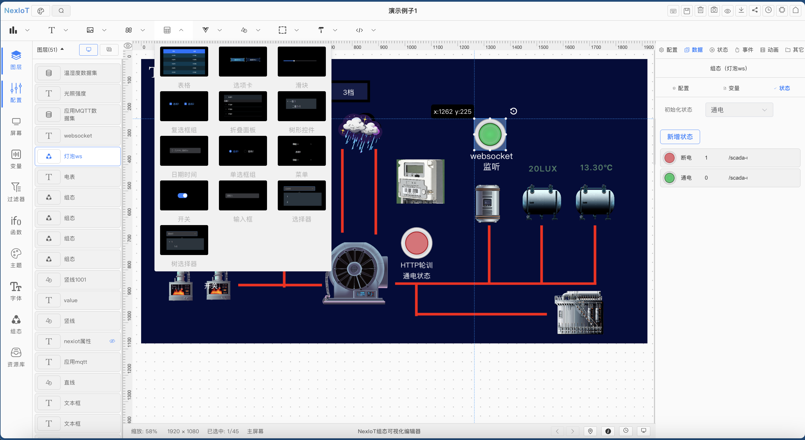 |
| 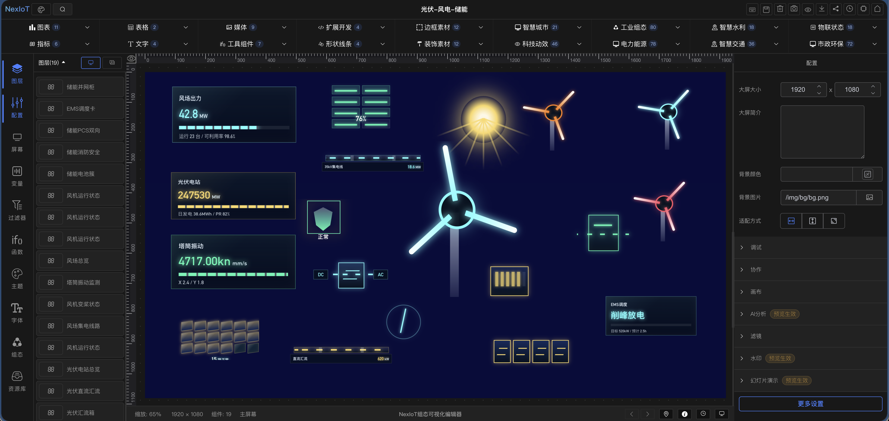 | 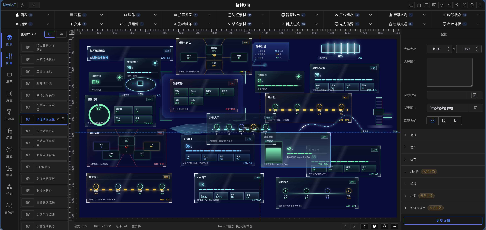 |
| 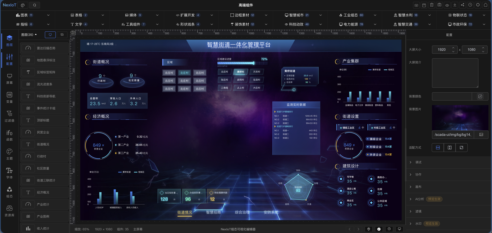 | 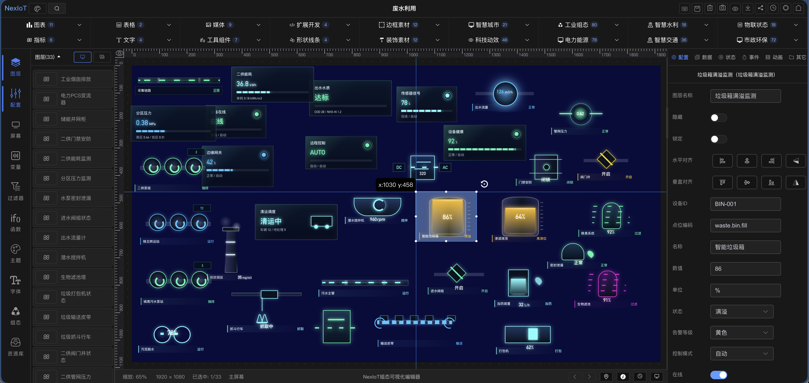 |

### 🎯 移动端/小程序

|                                               |                                              |                                              |
|-----------------------------------------------|----------------------------------------------|----------------------------------------------|
|  | 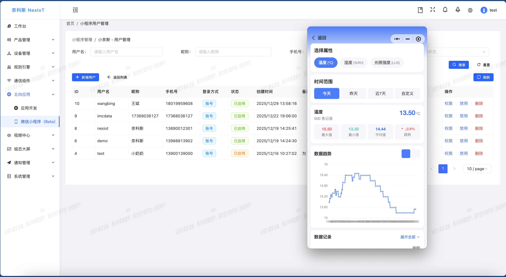 | 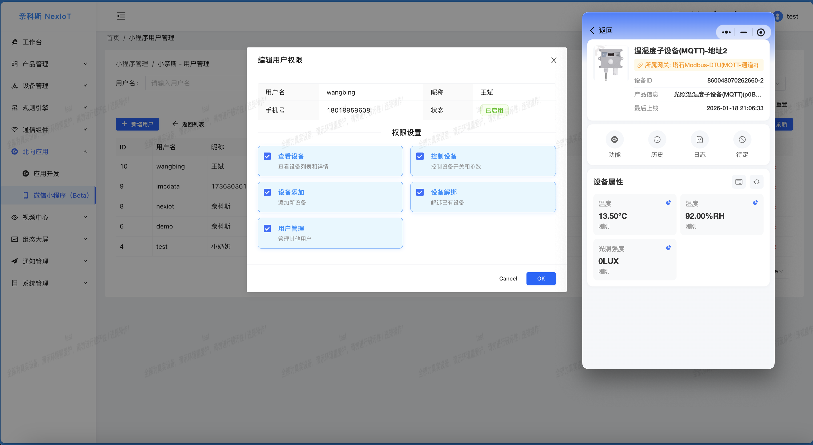 |
|  | 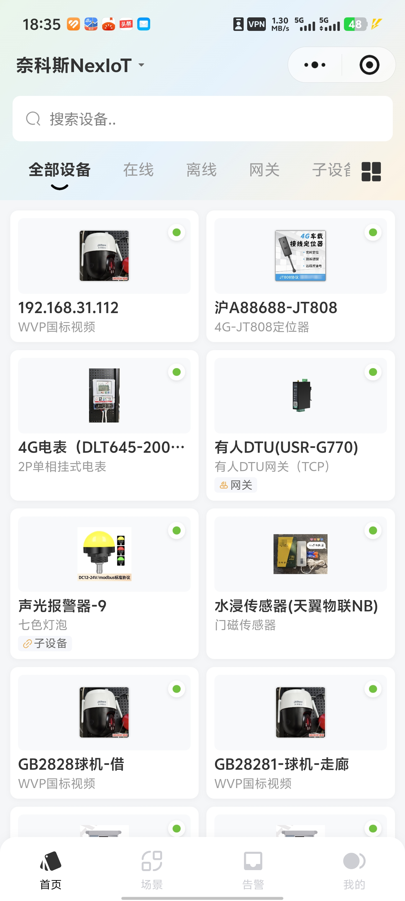 | 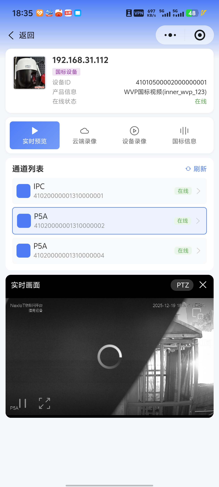 |
|  | 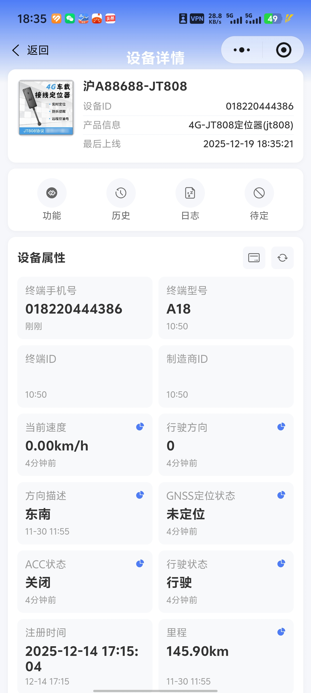 | 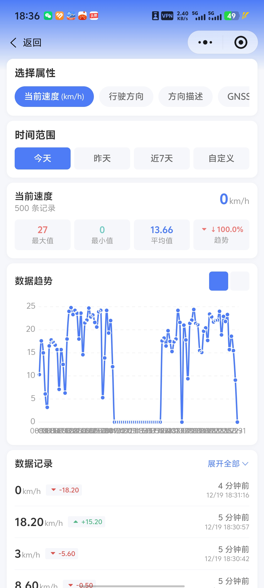 |

> 视频【NexIoT小程序，这次很强！】 https://www.bilibili.com/video/BV1WMqDB6EAc/?share_source=copy_web&vd_source=c9e1500efcc8aa0763f711fadaa68dff

### 🎯 一些指南

|                                               |                                              |                                              |
|-----------------------------------------------|----------------------------------------------|----------------------------------------------|
|  |  |  |

### 🎯 API

## 📺 视频教程

更多视频请关注B站和抖音

### 📚 基础入门教程

| 序号 | 教程名称 | 视频链接 |
|:---:|:---|:---|
| 1 | 【NexIoT课程】（一）IDEA与Docker一键启动 | [📺 B站观看](https://www.bilibili.com/video/BV1WNUnBnEx5/?share_source=copy_web&vd_source=c9e1500efcc8aa0763f711fadaa68dff) |
| 2 | 【NexIoT课程】（二）EMQX配置 | [📺 B站观看](https://www.bilibili.com/video/BV1MdUJB4E7k/?share_source=copy_web&vd_source=c9e1500efcc8aa0763f711fadaa68dff) |

### 📨 MQTT接入教程

| 序号 | 教程名称 | 视频链接 |
|:---:|:---|:---|
| 1 | 任意主题Topic与全流程对接教程 | [📺 B站观看](https://www.bilibili.com/video/BV1q1UZBmEHS/?share_source=copy_web&vd_source=c9e1500efcc8aa0763f711fadaa68dff) |

### 🌐 社区联系方式

|微信                            | B站                              | 抖音                               | qq群                          |
|-------------------------------|---------------------------------|----------------------------------|------------------------------|
|   |  |  |  |

## 📄 开源协议与重要声明

- **开源协议**：本项目遵循 Apache-2.0 开源协议，允许个人及企业在遵守协议与本声明的前提下进行商用用途、学习研究和二次开发
- **保留声明**：任何使用、修改、集成、抽取或部署本项目时，不得删除本项目LOGO、来源、版权信息、License、NOTICE、代码注释及相关声明
- **禁止行为**：严禁去标识化、冒名发布、二次开源、二次分发、转授权，或将本项目内容包装为自有项目/产品对外传播/申请软著
- **法律追责**：违反上述要求的，将依法追究相关法律责任
- 
> ⚠️ **特别提示**：  
> 您对 NexIoT 的任何使用行为（下载、部署、修改、商用等）即视为您**已充分理解并接受**本协议声明及其附加条款。如不同意，请立即停止使用并删除所有相关资源。

### 🙏 致谢

感谢以下开源项目和技术平台：

- **开源框架**：若依、Antdv、jetlink、ssssssss-team
- **云平台**：阿里云、华为云、腾讯云、AEP、OneNet 等物联网平台
- **社区支持**：所有贡献者和用户的支持与反馈

[//]: # ()
[//]: # (### 行业客户案例)

[//]: # ()
[//]: # ()
[//]: # (**当前已覆盖智慧城市、工业领域、轨道交通、交通基建、企业服务等多条行业线。**)

[//]: # ()
[//]: # (<table>)

[//]: # (  <tr>)

[//]: # (    <td align="center" width="50%">)

[//]: # (      <strong>智慧城市</strong> )

[//]: # (      市/区级智慧城市物联网平台)

[//]: # (    </td>)

[//]: # (    <td align="center" width="50%">)

[//]: # (      <strong>100余家科技企业</strong> )

[//]: # (      持续服务多类企业客户)

[//]: # (    </td>)

[//]: # (  </tr>)

[//]: # (  )
[//]: # (  <tr>)

[//]: # (    <td align="center" width="50%">)

[//]: # (      <strong>校园教育</strong>  )

[//]: # (      教育局智慧化、智慧校园等)

[//]: # (    </td>)

[//]: # (    <td align="center" width="50%">)

[//]: # (      <strong>企业园区</strong>  )

[//]: # (      实验室、企业园区、智慧车间等等)

[//]: # (    </td>)

[//]: # (  </tr>)

[//]: # (   <tr>)

[//]: # (    <td align="center" width="50%">)

[//]: # (      <strong>轨道交通</strong>  )

[//]: # (       )

[//]: # (      深圳地铁)

[//]: # (    </td>)

[//]: # (    <td align="center" width="50%">)

[//]: # (      <strong>交通基建</strong>  )

[//]: # (       )

[//]: # (      云南交投)

[//]: # (    </td>)

[//]: # (  </tr>)

[//]: # (</table>)
